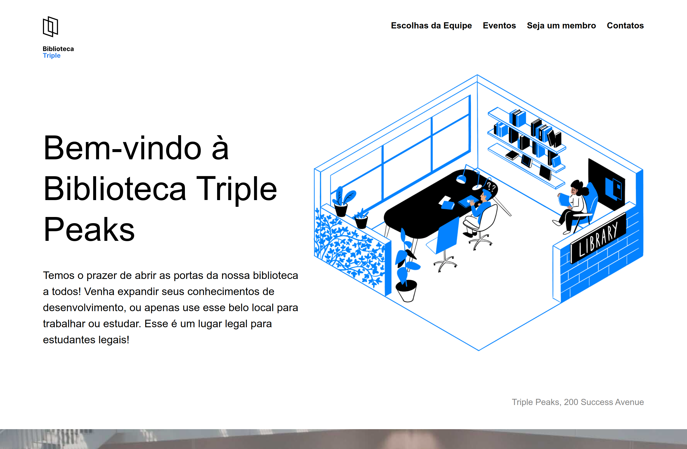

# Biblioteca Triple Peaks

A **Biblioteca Triple Peaks** é uma landing page que apresenta o menu de navegação e uma descrição da biblioteca no cabeçalho. O conteúdo principal da página está dividido em seções com indicações de livros feitas pela equipe, eventos no local, informações sobre como se tornar membro da biblioteca e um rodapé com horário de funcionamento e links para redes sociais.

**Veja o projeto em execução clicando [aqui](https://vinimello90.github.io/web_project_library/).**

## Recursos do Projeto

- HTML5 semântico
- Metodologia BEM
- Flexbox
- Hover

## Descrição das Tecnologias e Técnicas Utilizadas

### HTML Semântico

A utilização de **HTML semântico** melhora a legibilidade e acessibilidade do código, facilitando a manutenção e a compreensão do conteúdo.

### Metodologia BEM

Adotei a **metodologia BEM (Bloco, Elemento, Modificador)** para organizar as classes CSS, o que torna o código mais escalável, modular e fácil de manter.

### Flexbox

O `flexbox` foi utilizado para garantir uma distribuição eficiente e responsiva dos elementos.

### Hover

A pseudo-classe `:hover` foi aplicada aos links e outros elementos interativos, proporcionando feedback visual ao passar o cursor sobre eles.

## Header

O **header** contém o menu de navegação e uma breve descrição sobre a biblioteca. Utilizei `flexbox` para organizar os elementos de maneira responsiva. A pseudo-classe `:hover` foi aplicada aos links para alterar sua cor ao passar o cursor sobre eles.

## Main

### Seção Staff

A **seção de Staff** apresenta os cards com indicações de livros feitas pela equipe. Utilizei `flexbox` para distribuir os cards de forma organizada e responsiva.

### Seção de Eventos

Na **seção de Eventos**, são exibidas informações sobre os eventos no local. Para organizar a disposição dos elementos, utilizei `flexbox` e a propriedade `position` para ajustar a posição das imagens.

### Seção de Membros

A **seção de Membros** apresenta o passo a passo para se tornar um membro da biblioteca. Utilizei `flexbox` para organizar os elementos de forma clara e acessível.

## Footer

O **Footer** contém a logo da biblioteca, o horário de funcionamento, links para as redes sociais e informações de copyright. Utilizei **flexbox** para organizar os elementos e a pseudo-classe `:hover` para alterar a cor dos links ao passar o cursor sobre eles.

